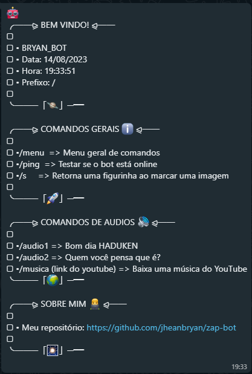

# zap-bot
Bot Whatssap feito usando como base a API do Baileys  

## Dependências
<ul>
    <li>@adiwajshing/baileys</li>
    <li>@hapi/boom</li>
    <li>@whiskeysockets/bailey</li>
    <li>curl</li>
    <li>qrcode-terminal</li>
    <li>ytdl</li>
</ul> 

## Comandos Aceitos

| Comando |Ação |
| ------------ | :----------: |
| /menu | Exibe o menu de comandos |
| /ping | Retorna Pong|
| /s | Transforma uma imagem em figurinha ao marcar uma imagem |
| /audio1 | Retorna um audio de Bom Dia|
| /audio2 | Retorna um audio do Rodrigo Goes|
| /musica | Baixa uma música do youtube (deve ser passado o link da música depois do comando) |
| /cep | Busca dados de um CEP (deve ser passado o cep em formato númerico. EX: 79200000) |

